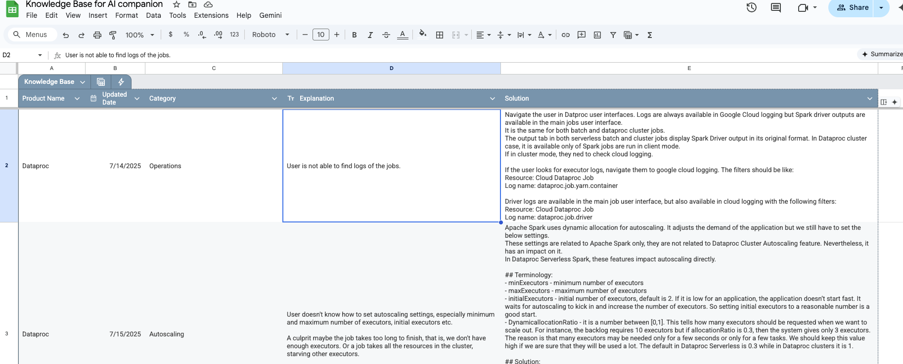
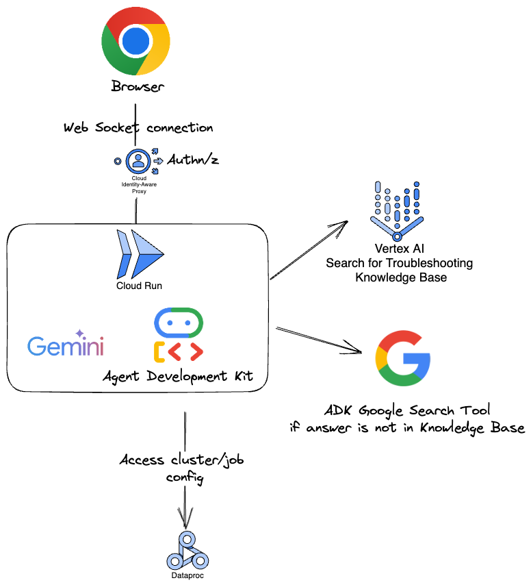

# AI Companion

AI companion is a co-browser agent that is built to help users troubleshoot their use case with sharing a browser with an AI agent.
By screen sharing, AI agent becomes more effective in guiding a user to resolution.

Co-browsing is done via Human agents, and it is very effective. However, it doesn't scale and also it raises privacy issues as the human agent
can see all your details. On the other hand, AI agents can scale and since the AI APIs are under your control, you don't have to worry about
information leakage.

In this demo, we defined some troubleshoot cases for Google Cloud Dataproc. We loaded them into Vertex AI search which acts as the RAG backend.
When the end user asks about a problem, AI agent searches among the problems and guide the user to the solution.
If you want to adjust the application for your own use case, you need to replace the knowledge base.

<a href="http://www.youtube.com/watch?feature=player_embedded&v=kRxFzM_UUU8" target="_blank"></a>


## Learnings with initial tests
**Should I train with UI:** Since Google Cloud UI is public and there are many examples online, we never had to give any prompts for the UI. 
Even if there are new features added to the UI, AI reads the page really fast. So by just providing some prompts like first go to tab X and then click link etc., 
you may help AI to navigate the page.

**Why should I give troubleshooting cases?** When we don't give troubleshooting steps, AI answers from its own world knowledge, which 
(i) starts with basic stuff like "have you enabled Dataproc API" which has no value for someone who is already running Dataproc
(ii) cannot do advanced, multi step troubleshooting. 

So it is best to provide a step by step guide.

## Setup:
```sh
# install dependencies with uv
make install
```

The application uses Vertex AI search tool, it requires to use Google Cloud Vertex AI endpoints and not the AI studio.
For that reason, you need to set application-default login. 

Copy [.env_example](.env_example) file to `.env` and then configure it. 


```sh
# Run the code:
make playground-full-ui
# navigate in your browser to localhost:8000
```

```sh
# Create a docker image with cloud build
make build-container
# deploy to cloud run
make deploy-cloud-run
```


## Adding new cases

The cases are served from Vertex AI Search. To make it easier to add new cases, we have created a Google sheet where you can add more.
Vertex AI Search doesn't support Google sheet directly. We load the sheet into a BigQuery external table and then into a native table, since vertex Search supports only native tables.

After loading to the native table, you should also update the Vertex AI Search to re-index the data. That also happens nightly but you can manually trigger it.



# Architecture

The architectre is straight forward, there is a central AI agent that uses Gemini Live which can use tools to help you troubleshoot your applications.
Current tooling are:
* Vertex AI search to search for solutions for the problems
* Google Search to search for solutions when vertex AI search doesn't have answers listed
* get_dataproc_cluster_list (disabled in demo since service account doesn't have access to end user environment), 
* get_dataproc_cluster_detatils (disabled in demo since service account doesn't have access to end user environment),
* get_dataproc_job_output (disabled in demo since service account doesn't have access to end user environment),

For the Dataproc related tooling, you need to give IAM rights to the service account of the AI agent.

~

# How to Demo (For Googlers)
The demo application is live in [demos](https://cloud-demo-hub.corp.google.com/demo/1463) page.
Current [instructions](https://docs.google.com/spreadsheets/d/1y3ZBCgio05DUl--Vd_z-ORiv3JyVp_8gxTYPVBYqGOo/edit?gid=0#gid=0) for the AI agent is to debug a Dataproc Spark and Composer. Reach out to us to add new cases. It is super easy to add new instructions.

**Finding logs:** A case that we see in many customers is that it is confusing to find the executor logs of Spark Jobs. While you can see the driver log jobs in the Dataproc Jobs UI, executor logs are in Cloud Logging. AI agent guides the user to find the logs.
Ask the AI agent where to find Dataproc Spark executor logs, then it takes you to Cloud logging. If you already have a job with logs, then it is better. It shows you which fields to filter to find the logs.

**Finding Dataproc Spark UI:** Spark UI is the best interface to debug an application. Many users are not aware of its existence and they don't know where to find it. AI agent can help them to figure that out. Ask the AI agent where to find the Spark UI and it will guide you to it.
